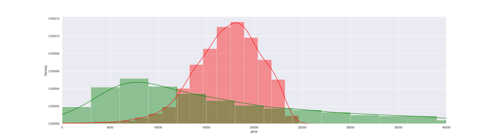
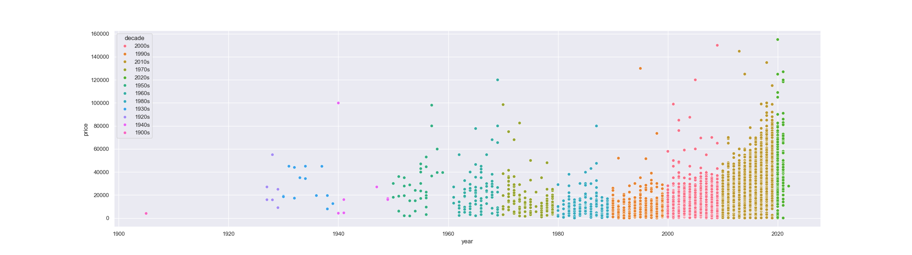

# PRICE OF A CAR
GitHub Repository for work done on Professional Certificate in Machine Learning and Artificial Intelligence - December 2022

Link to Jupyter Notebook Link -> https://github.com/stephytony/priceofacar_MLAI_11.1_PA2_2025/blob/main/prompt_price_of_a_car.ipynb 

# Practical Application Assignment 11.1: What Drives the Price of a Car?

**Contents**

 * [Introduction](#Introduction)
 * [How to use the files in this repository?](#how-to-use-the-files-in-this-repository)
 * [Business Understanding](#Business-Understanding)
 * [Data Understanding](#Data-Understanding)
 * [Data Preparation](#Data-Preparation)
 * [Regression Model](#Regression-Model)
 * [Findings](#Findings)
 * [Next steps and Recommendations](#Next-steps-and-Recommendations)
 * [License](#license)
 
## Introduction

This repository contains the Jupyter Notebook for the Application Assignment 11.1. This takes a sample jupyter notebook to complete the exercise to analyse Kaggle used car data in [vehicles.csv](https://github.com/yemifalokun/priceofacar/blob/main/data/vehicles.csv) file in the data folder of this repository to build a machine learning application that evaluates if vehicles features like Fuel, Condition, Size, Type, Color etc. can be used to determine used car prices for the Car Dealership and Sales Team. This evaluation will help the Car Dealership with fine tuning their inventory by stocking cars that consumers are interested in.

## How to use the files in this repository?

The notebooks are grouped into the following categories:
 * ``data`` – vehicles.csv data file from Kaggle Machine Learning dataset repository used in the notebooks
 * ``images`` – Image files used in Notebook and Project Description
 * ``primpt_price_of_a_car`` – What Drives the Price of a Car Notebook

## Business Understanding

The business objective is to identify key features for used car prices based on the dataset provided so that Car Dealers and their Sales Team can use these key features to understand the cars that they need to have in their inventory to increase sales.

For this application, we used a machine learning process which starts with gathering the data, cleaning, preparing and manipulating the data, training the model then testing to get predicted values and measure model accuracy. As part of the life cycle, additional data from sales should be used on an on-going bases to “improve” the model which leads to higher prediction accuracy on the factors that  consumers are looking for in used cars. 

Source - https://centricconsulting.com/blog/machine-learning-a-quick-introduction-and-five-core-steps/

## Data Understanding

The first thing that was apparent from the provided data was that it was not clean, it had missing values and some of the values were not realistic for used cars, for example, odometer with zero and single digit values; price with zero and single digits values.

As you can see from the Diagram above, there are car prices with zero value for all conditions.

## Data Preparation

Summary of the Data Preparation is as follows:
- Remove records with Zero Prices and Odometer values
- Remove records where some of the factors are not populated
- Drop a number of factors (i.e., VIN, id, region etc.) that are not significant in user car price determination
- Review and remove the other factors (i.e., state, paint color, manufacturer, transmission etc.) and check if they have an impact on car price based on the provided data
- Filtering the data based on year on manufacture = 1990 as the number of vehicles before 1990 were very low

## Regression Models

We ran a number of models (7 to be exact) to create 7 ML Models or AI Applications using the full set of features after data manipulation and a subset of features based on the correlation matrix between the features and used car prices. 

Additional filtering (i.e., Price and Odometer > 5000 and Year > 1990) were also used to create datasets used from some of the models below.

For Most of these Models, the accuracy was less than 50% with the exception of the last 2 models. See table below:

| Model Name  	| Description                                                                                                                      	| Accuracy Score (Training) 	| Accuracy Score  (Test) 	|
|-------------	|:----------------------------------------------------------------------------------------------------------------------------------	|:-------------------------:	|:----------------------:	|
| Model       	| Built with all features from data manipulation dataset                                                                           	| 44.54                     	| 43.09                  	|
| Model1      	| Odometer and Year as inputs from data manipulation dataset                                                                       	| 6.94                      	| 1.92                   	|
| Model2      	| Odometer and Price greater than 5000, Odometer and Year as inputs                                                                	| 12.45                     	| 12.54                  	|
| Model3      	| Odometer and Price greater than 5000, Year as the only input                                                                     	| 0.3                       	| 0.26                   	|
| Model4      	| Odometer and Price greater than 5000, odometer as the only input                                                                 	| -97.45                    	| -96.91                 	|
| Model6      	| Odometer and Price greater than 5000 with Odometer, Year, fuel_diesel, drive_4wd  and size_full-size as the only inputs              	| 45.26                     	| 46.88                  	|
| Model7      	| Odometer and Price greater than 5000 and  Year > 1990 with Odometer, Year, fuel_diesel,  drive_4wd and size_full-size as the only inputs 	| 47.52                     	| 48.26                  	|
|             	|                                                                                                                                  	|                           	|                        	|

Based on the scores, there is still some way to go to get to a model with a higher accuracy score with the highest score for training and testing data currently less than 50%

It's also not a coincidence that the highest score of 47.52% and 48.26% reflects the highest numbers for correlation between these features and price from the correlation matrix.

## Findings

In testing these models with the inputs, we observed the following for used car prices:

| Model Name  	| Test Description                                                                     	| Predicted Used Car Price ($) 	|
|-------------	|:--------------------------------------------------------------------------------------	|:----------------------------:	|
| Model       	| New car with 100 miles, condition excellent and new with diesel and four wheel drive 	| -98,263.87                   	|
| Model       	| New car with 100 miles, condition good and with Electric and front wheel drive       	| 29,013.33                    	|
| Model1      	| New car with 100 miles                                                               	| 21,112.15                    	|
| Model1      	| Old 2001 car with 90000 miles                                                        	| 17,566.90                    	|
| Model2      	| New 2022 Car with 100 miles                                                          	| 26,627.40                    	|
| Model3      	| Car with Year of 1980                                                                	| 18,540.07                    	|
| Model3      	| Car with Year of 2020                                                                	| 18,914.62                    	|
| Model4      	| Car with Odometer of 50000                                                           	| 5,919.20                     	|
| Model4      	| Car with Odometer of 100000                                                          	| 11,838.40                    	|
|             	|                                                                                      	|                              	|

As you can see, the Machine Learning application "Model" built using all the final dataset from the data manipulation phase which included features like Odometer, Year, Condition, fuel type, drive train and size returns a negative value (i.e., -$98,263.87) which is not realistic for a "new car with 100 miles, condition excellent and new with diesel and four wheel drive".

Same Model returned $29,013.33 for new car with 100 miles, condition good and with Electric and front wheel drive.

For ML Applications ``Model6`` and ``Model7`` which are the recommended/selected models, see below for the prediction testing results:

| Test Description                                                         	| Predicted Used Car Price Model6	| Predicted Used Car Price Model7 ($)	|
|:--------------------------------------------------------------------------	|:-------------------------------:	|:-------------------------------:	|
| Car with Year of 1940, 100k Miles with Diesel Fuel, 4WD and Full Size    	| 38,785.04                      	| 39,107.49                      	|
| Car with Year of 1990, 100k Miles with No Diesel Fuel, 4WD and Full Size 	| 22,417.60                      	| 22,569.71                      	|
| Car with Year of 2020, 10k Miles with Diesel Fuel, 4WD and Full Size     	| 47,456.98                      	| 48,238.24                      	|
| Car with Year of 2020, 10k Miles with No Diesel Fuel, 4WD and Full Size  	| 31,089.55                      	| 31,700.49                      	|
|                                                                          	|                                 	|                                 	|

With regards to high quality model based on the dataset provided, ``Model6`` and ``Model7`` are the recommended models.

When we analyze the importance of feature selection based on the trained model, we observe the following order
- ``Model6`` - Diesel Fuel, Odometer, Four Wheel Drive, Full Size and Year
- ``Model7`` - Diesel Fuel, Year, Odometer, Four Wheel Drive and Full Size

## Next Steps and Recommendations

As the data provided is not that clean with null, NAN, zero, missing and unrealistic values, further filering of the data could be done, for example, selecting used car records with recent years.

This should allow the model to use more of the newer car features like model, cylinders, drive, size which may have a greater influence on newer used car prices with lower odometer. This may also lead to a higher/better model accuracy (i.e., > 50%)

More and better data can be collected to train the model. This data should include the newer features on used cars like Automated Driving Safety Features, Infotainment, Cameras, Remote Start, Car Mileage which have an impact on used car prices.

Additional Data on used car datasets can be downloaded from [Kaggle Used Cars Datasets](https://www.kaggle.com/search?q=used+cars)

We would recommend some form of classification/categories for features like paint_color, state etc so that we can include them with fewer permutations in the model.

From the current models created, ``Model6`` and ``Model7`` would be the recommended models to use.  

These models were built with the following logic:
- ``Model6`` - Odometer and Price greater than 5000, Odometer, Year, fuel_diesel, drive_4wd  and size_full-size as the only inputs
- ``Model7`` - Odometer and Price greater than 5000, Odometer, Year > 1990, Year, fuel_diesel,  drive_4wd and size_full-size as the only inputs

These models  provided the following model feature selection:
- ``Model6`` - Diesel Fuel, Odometer, Four Wheel Drive, Full Size and Year
- ``Model7`` - Diesel Fuel, Year, Odometer, Four Wheel Drive and Full Size

For Next Steps, while the recommended models (i.e., ``Model7`` etc.) can be deployed, we would also recommend gathering more quality data that would produce a model with an accuracy of 75%+ based on used cars data no more than 10-15 years old.

Updated data should also provide a better indication on the latest features that consumers are looking for so that the Dealership can source these cars for their inventory.

